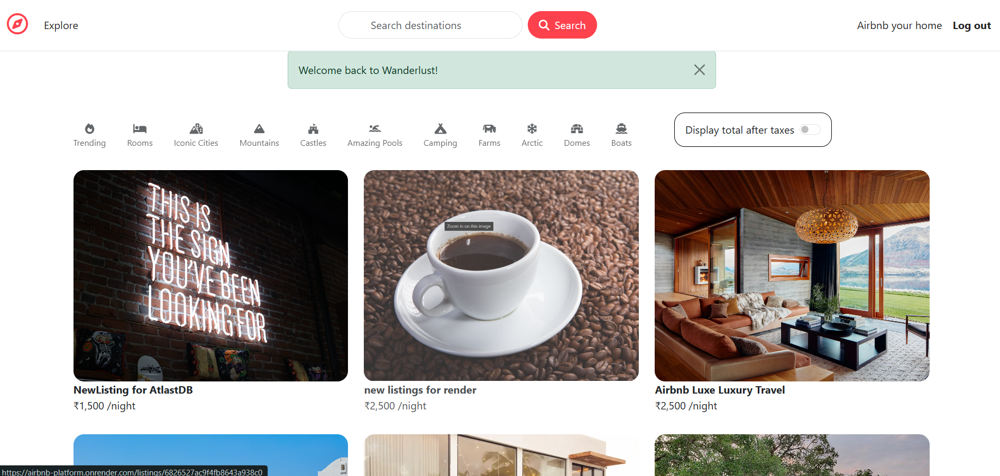

# Project Name: Wanderlust Rental Platform
 
 # Domain : Travel & Tourism

Wanderlust Rental Platform is a full-stack travel and accommodation listing web application, similar to Airbnb, designed for users passionate about exploring new destinations. It enables travelers to discover unique stays and allows hosts to list, manage, and update rental properties such as hotels, apartments, and vacation homes.

My Role & Key Features Implemented:

- User Authentication & Authorization: Secure sign-up and login features with cookie-based session management to protect data.

- User-Created Listings: Hosts can create, edit, and delete hotel/property listings with detailed information and images.

- MVC Architecture: Organized application structure using the MVC model for better  modularity and maintainability.

- Flash Messaging: Real-time notifications for various user actions, such as authentication and CRUD operations.

- Image Upload & Management: Users can upload and manage images associated with their listings.

- RESTful APIs: Developed RESTful APIs for efficient client-server communication.

- MongoDB Integration: Utilized MongoDB for storing and managing data related to listings and user reviews.

-Implemented comprehensive validation and error handling on both frontend and backend to ensure a smooth user experience.

Technology / Framework:

 Frontend:

HTML5 – Structure of the web pages

CSS3 / Bootstrap – Styling and responsive design

EJS (Embedded JavaScript Templates) – Dynamic rendering of frontend pages

 Backend:

 Node.js – Server-side JavaScript runtime

 Express.js – framework for building RESTful APIs and routes

 MongoDB – NoSQL database for storing users, listings, and reviews

 Tools & Libraries:

 Express-Session – For session management

 Connect-Flash – For displaying success/error messages

 # Deployment :(Project link)

 https://airbnb-platform.onrender.com/signup

 

###  Sign Page &  Login Page &  Listing Page &  Create Page &   Edit-page &  Review & Comment

  
  &nbsp;&nbsp;&nbsp;
  
  &nbsp;&nbsp;&nbsp;
  
  &nbsp;&nbsp;&nbsp;
  
  &nbsp;&nbsp;&nbsp;
  
   &nbsp;&nbsp;&nbsp;
    

